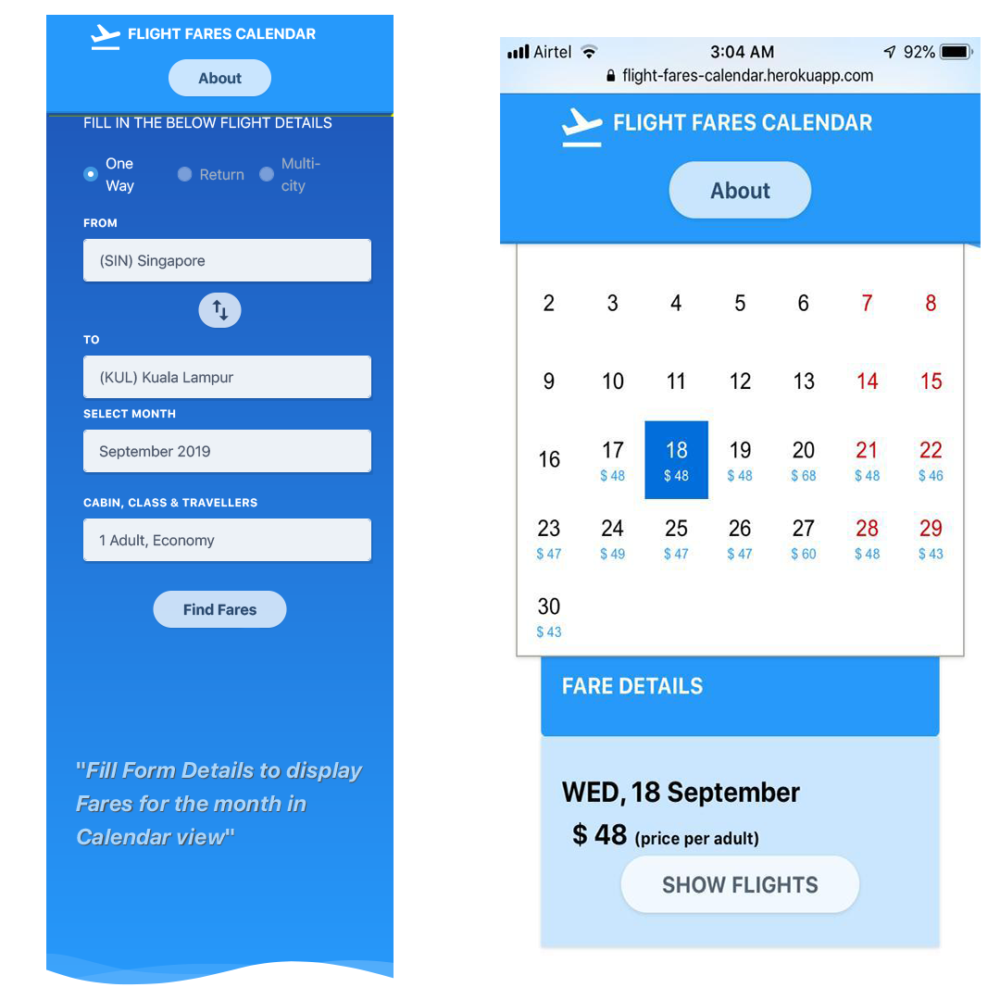
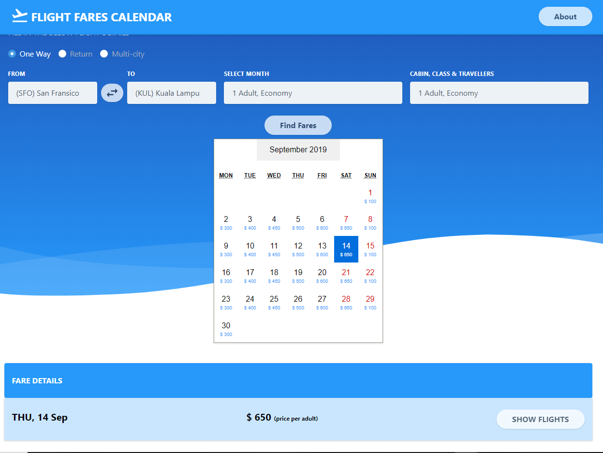
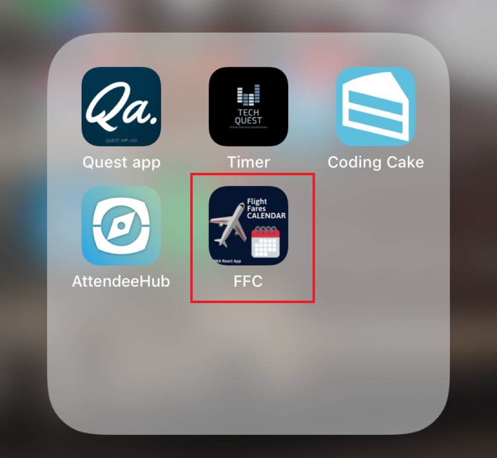

# Solution Documentation & Approach

- Assignment selected: _Assignment - A: Flight Fares Calendar_
- Time of Submission: _16th September 2019 - 4 AM IST Timings_

# About

_To display flights fares for selected month in calendar view_

- The Live working version of the web app can be [found here](https://bit.ly/2miObda)
- Alternate Link - https://flight-fares-calendar.herokuapp.com/
- Github Repo can be found here - [Gihub Link](https://github.com/avj2352/flight-fares-calendar)

# Description 
_Your task is to find the flight status for a month and display them in a calendar format. You can use Skyscanner Flight Search for fetching flight fares. The flight fares should be for 3 routes (one way). The routes are:_  

```bash
1. SIN – KUL 
2. KUL – SIN 
3. KUL – SFO 
```

---

# Tech Stack - Libraries & Frameworks used

The following Provides the Detailed List of Libraries, Tools, Frameworks & Platforms used in building the Application

## Frontend
- _React JS (v 16.9.0)_
- _Typescript (v 3.4.3)_
- _React-Calendar_
- _TailWindCSS_
- _React-Notifications_
- _React-Icons-Kit_
- _Enzyme_
- _Create React App_
- _ESLint_

## Backend

- _Node JS (v 10.x)_
- _ES6 (Babel)_
- _Express (4.16.4)_
- _Rapid API (Unirest SDK)_
- _Chai_
- _Chai-http_
- _Mocha_
- _Nodemon_

## Tools & Platforms

- _Github_
- _VS Code Editor_
- _Heroku (heroku cli)_
- _Adobe XD_

---

# Points to Consider

- Find Flight status for the month. (Consider startDate as the date when app loads)
- Use **Skyscanner Flight Search** for fetching flight fares.
- Flight Fares considered for the following 3 routes
  - `SIN - KUL`
  - `KUL - SIN`
  - `KUL - SFO`
- Following are the constants to consider
  - _Flight fares for one adult only_
  - _Show calendar for 1 month from the current date_
  - _Information to be provided in calendar format_
  - _Use Country as `US`_
  - _Use Currency as `USD`_
- Create a Rapid API account and fetch Rapid API key
- Test Driven Development
- Working Demo deployed on Heroku
- Github link to be provided
- [API Link](http://partners.api.skyscanner.net/apiservices/pricing/hk1/v1.0/3f6d1606-c0ca-445e-8cbe-a0325bcef21e)

---

# Approach

## 1. UI References

Looked up online for Several UI References. The Following 2 references came close to the Usecase / Design Requirement

1. Skyscanner Web Application


---

2. Flight Search Codepen Design


## 2. Design - Wireframes

- Using the References, Came up with a Low Fidelity Wireframes. Used **Adobe XD** to come up with the Wireframes
- Considered Mobile first approach to design, Aim was to ensure App is responsive and fits the mobile screens also


- Designed Low Fidelity Wireframe to Large Desktop / Tablet Devices


## 3. Tech Stack to consider

Once the wireframe was designed, It was clear to select which libraries / frameworks to work with. The following were considered.

- _React JS + Typescript + TailWind CSS + Axios_
- _Node (Express) + ES6 + Babel_
- _Github for Versioning, CI/CD pipeline_
- _Heroku for Cloud Deployment_

## 4. Design Application

The Application was designed with a **Mobile First Approach in mind**. The Aim was to make _the Calendar accessible and readable even on handheld devices with small width_.




This would ensure responsiveness even for large screens as the devices start getting larger




# Design Patterns

My Aim in any given application development / prototype is to always limit the excess use of any libraries for just one / two tasks and try to leverage the selected library / platform to its full features offered.

## a. Backend

### 1. MVC Design Pattern

For the Backend, Express provides out of the box routing feature, which is great for building **MVC - Model View(Service) Controller** where the View is actually the main routing that appens within the application.

### 2. Babel + Test Driven Development

Wrote custom Node scripts with a **Test Driven Development** approach in mind. Also Babel ensures that the final applciation is all available, bundled under `build` folder.

> NOTE: If the Test fails, The Build will not get generated


---

## b. Frontend

### 1. React (Hooks) + Typescript

For the Frontend, Typescript + React version 16.x which offers the new feature - Hooks. The following React Design Patterns were implemented:

### 2. Compound Patterns

With respect to React components, this could mean a component that is composed of two or more separate components. Any React component can be composed of 2 or more separate components. So, that’s really not a good way to describe compound components. The main component is usually called the parent, and the separate composed components, children.

- For Example, in the current application:

- **Parent** : FareDetailsForm Component
- **Child** : OriginDestinationSelect Component
- **Child** : Select Component

### 3. Use of Hooks + Context API

the Application showcases use of both Context & Hooks. **All Components are mainly Functional Components** in this application. This provides an ease when it comes to testing also makes the application modular and reusable.

- useState
- useContext
- useRef

### 4. Leveraging Typescript

Even though most of the components, are Functional components, using Typescript we can still gain the upper ground of ensuring proper Props being passed to each component, and strict datatyping.

---

### 5. PWA

In order to provide a consistent feel across Devices (both desktop & mobile) - Leveraged PWA so that the application can be saved on the Iphone / Android mobile as a Native Icon




# Color Pallette

- #0086FF
- #00B4FF
- #47CF73
- #445878
- #9ca0b1

---