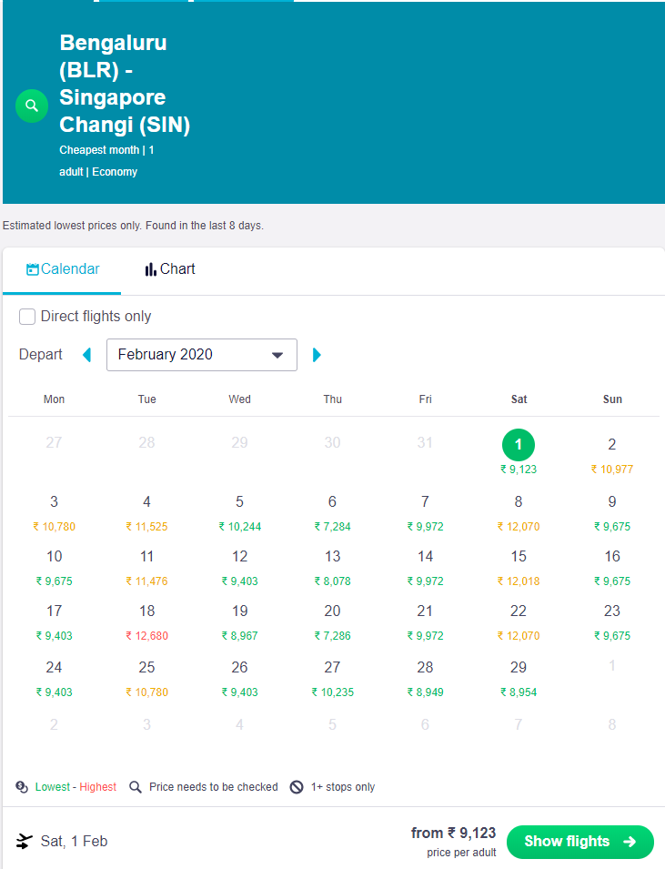
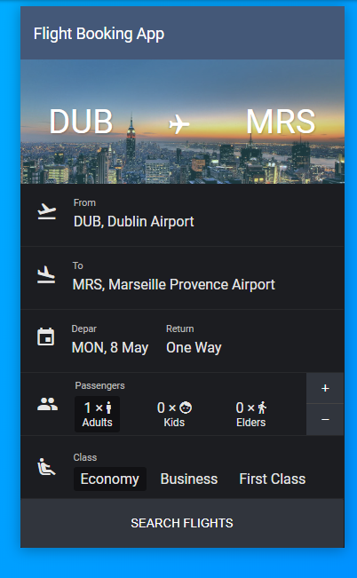

# Solution Documentation & Approach

### Challenge A - _To display flights fares for selected month in calendar view_

# Points to Consider

- Find Flight status for the month. (Consider startDate as the date when app loads)
- Use **Skyscanner Flight Search** for fetching flight fares.
- Flight Fares considered for the following 3 routes
  - `SIN - KUL`
  - `KUL - SIN`
  - `KUL - SFO`
- Following are the constants to consider
  - _Flight fares for one adult only_
  - _Show calendar for 1 month from the current date_
  - _Information to be provided in calendar format_
  - _Use Country as `US`_
  - _Use Currency as `USD`_
- Create a Rapid API account and fetch Rapid API key
- Test Driven Development
- Working Demo deployed on Heroku
- Github link to be provided

# UI References

Looked up online for Several UI References. The Following 2 references came close to the Usecase / Design Requirement

1. Skyscanner Web Application

---

2. Flight Search Codepen Design

# Design - Wireframes

- Using the References, Came up with a Low Fidelity Wireframes. Used **Adobe XD** to come up with the Wireframes
- Considered Mobile first approach to design, Aim was to ensure App is responsive and fits the mobile screens also

- Designed Low Fidelity Wireframe to Large Desktop / Tablet Devices

# Tech Stack to consider

Once the wireframe was designed, It was clear to select which libraries / frameworks to work with. The following were considered.

- _React JS + Typescript + TailWind CSS + Axios_
- _Node (Express) + ES6 + Babel_
- _Github for Versioning, CI/CD pipeline_
- _Heroku for Cloud Deployment_